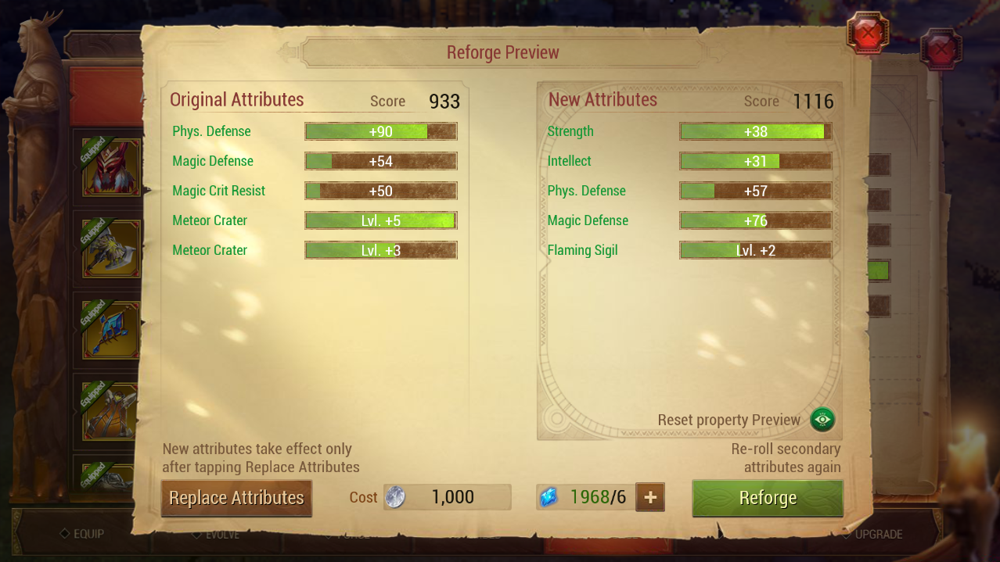

# Col Reforger

Hate reforging in Crusaders of light? This is the tool for you!

### Requirements
The only requirement to run this tool is java 8 JRE. Most computers already have this installed.
If you do not, you can install and set it up here: [Direct Download link from Oracle](https://www.oracle.com/java/technologies/javase/javase-jdk8-downloads.html)


### How to use
Simply ...

- Download the zipped release from [here](https://github.com/Onewaysidewalks/col-reforger/releases). E.g. colreforger-x64.zip
- extract the file into a folder.
- change the `reforger.yaml` to which stats you want to reforge for if needed. (The default is 2 skill roll, with 100 max attempts to get)
- make sure your CoL window is open to a screen that looks like this: 

 

- then double click the colreforger.jar for your architecture (32/64)! 
- Once the program detects your desired roll, it will stop!

Note: make sure the console window does not overlap with the CoL window.

Note: This program moves the mouse and clicks on your behalf. If you want to quit the program early, simply X out of the
of the console window

## WARNING: Only Warrior is supported at the moment

# Contributing

If you want to help contribute to which classes are supported, please open an issue with a bunch of screen shots of each possible skill for the class you want to add.

The screen shots should look exactly like this:


### For delevopers
To create release artifacts, run

```bash
./gradlew clean packageForRelease
```